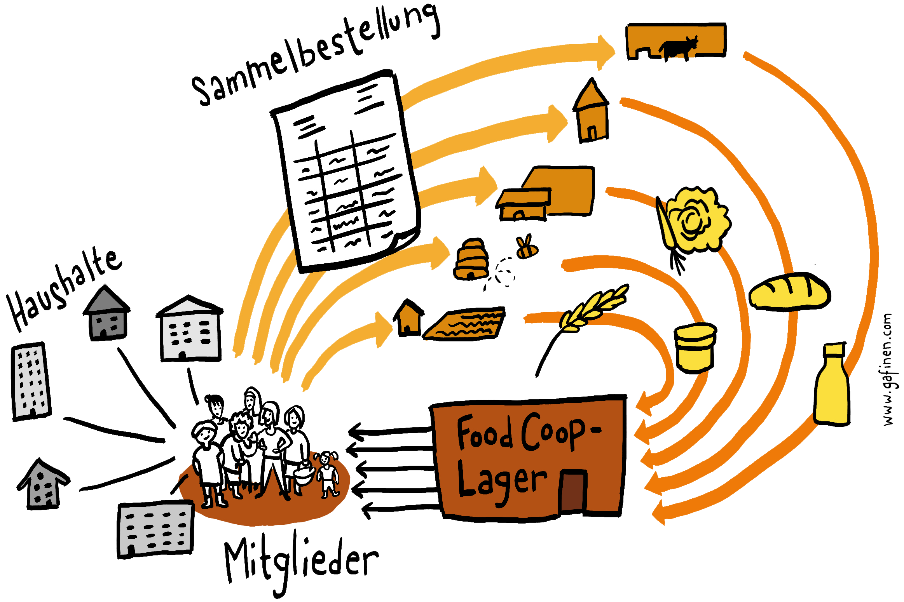

# Was ist eine FoodCoop?

In Österreich sind FoodCoops eine relativ neue Erscheinung,
während in anderen Ländern dieses Modell schon
seit Jahrzehnten etabliert ist. **Der Begriff FoodCoop**
wurde daher aus dem englischsprachigen Raum
übernommen. Die erste Hälfte ist schnell übersetzt: „Food“
heißt „Lebensmittel“. Die zweite Hälfte „coop“ ist die
Abkürzung für „cooperative“, auf Deutsch „Kooperative“.
Das heißt so viel wie „zusammenwirken“ oder „miteinander
etwas bezwecken“. In Summe bedeutet der Begriff
„FoodCoop“ also grob **„die Lebensmittelversorgung
gemeinsam gestalten“**.

**Der Grundgedanke** einer FoodCoop ist weder neu noch
innovativ, ganz im Gegenteil, er wird täglich unzählige
Male gelebt, etwa wenn eine Nachbarin oder eine Arbeitskollegin
fragt: „Ich hole mir vom Bauernhof Eier und Brot,
brauchst du auch was, soll ich dir was mitbringen?“ Bei
einer FoodCoop wird diese Frage auf einen größeren Personenkreis
ausgeweitet, das Miteinander-Einkaufen wird
organisierter angegangen und die Produkte stammen
nicht nur von einem einzelnen Bauernhof, sondern von
mehreren Bezugsquellen, sodass ein gewisses Grundsortiment
zustande kommt.

**Konkret sieht das so aus:** Ein paar dutzend
private Haushalte schließen sich zu einer
Einkaufsgemeinschaft zusammen.
Die Mitglieder, also die die einzelnen Haushalte,
bestellen gesammelt bei umliegenden
Bauernhöfen und anderen Anbietern.
Diese liefern die vorbestellten Waren an
einen zentralen Umschlagplatz, genannt das
„FoodCoop-Lager“. Dort erfolgt die Verteilung,
jede Konsumentin holt sich ab, was sie
vorbestellt hat.

> **Praxisbeispiel:** Bis Dienstag geben alle Mitglieder
> innerhalb der FoodCoop bekannt, welche Lebensmittel
> sie diese Woche benötigen. Am Dienstagabend
> erfährt die Gemüsebäuerin von der FoodCoop: „Wir
> brauchen diese Woche 27 Salate, 35 Karotten, ...“, an
> die Milchbäuerin geht die Info: „Wir brauchen diese
> Woche 23 Liter Milch, 17 Joghurt, ... “, usw.
> Die Bäuerinnen liefern am Freitag die bestellten
> Produkte ins FoodCoop-Lager. Dann kommen die
> Konsumentinnen. Anna hat z. B. einen Salat und
> zwei Joghurt bestellt, sie nimmt sich genau diese
> Produkte. Am Freitagabend sind alle frischen
> Lebensmittel abgeholt.

_Eine FoodCoop funktioniert wie ein Kreislauf: Private Haushalte
organisieren sich als Mitglieder der FoodCoop. Gemeinsam geben sie
Sammelbestellungen bei verschiedenen Anbietern ab. Diese liefern
die Waren in das FoodCoop-Lager. Dort holen die Mitglieder ihre
Vorbestellungen ab._

## Im Vergleich zu anderen Versorgungswegen haben FoodCoops einige recht praktische Vorzüge:

* Die Lieferantinnen können sich auf die Produktion der
Lebensmittel konzentrieren und müssen sich nicht stundenlang
Zeit fürs Verkaufen nehmen, wie etwa bei einem
Bauernmarkt. Für die Mitglieder steht trotzdem ein
gebündeltes Produktangebot zur Auswahl, ähnlich wie
auf einem Bauernmarkt.
* Durch die Vorbestellungen können die Produzentinnen
besser planen, die Konsumentinnen erhalten genau das,
was sie brauchen. Es entsteht kein unnötiger Lebenmittelmüll.
* Im Vergleich zu unternehmerischen „Geschäftsideen“
bringt eine FoodCoop so gut wie kein finanzielles Risiko
mit sich, es braucht kaum Startkapital und die laufenden
Kosten sind minimal.
* Eine FoodCoop kann im Prinzip von jeder motivierten
Gruppe gegründet werden, einschlägige Ausbildungen,
Befähigungen etc. sind nicht notwendig.

**Das wahre Potential von FoodCoops** wird bei der Aufzählung
solcher „technischer“ Vorzüge nicht sichtbar,
denn diese Initiativen sind viel mehr als eine Einkaufsmöglichkeit.
Zum erfolgreichen Gründen und Betreiben
einer FoodCoop gehört darum auch mehr, als einfach nur
Sammelbestellungen zu organisieren. Um zu verstehen
wie dieses Modell wirklich funktioniert und für wen es
eine sinnvolle und befriedigende Alternative darstellt,
sollen zuerst die Motive und Ziele beschrieben werden.
