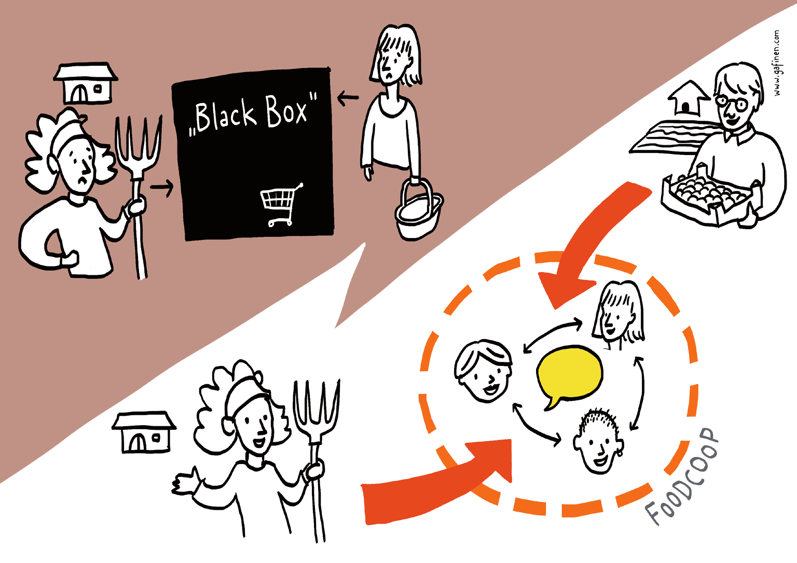

# Was leisten FoodCoops tatsächlich?

* FoodCoops sind eine **ehrliche und authentische Bezugsmöglichkeit
von Lebensmitteln** abseits von Werbebeschallung,
Lockangeboten oder überteuertem Luxusambiente.

* FoodCoops schaffen **Absatzwege auch für „nicht marktfähige“
Lebensmittel**. Große Chargenmengen oder standardisierte
Verpackungen mit Profi-Design sind nicht nötig, das
Obst muss weder glänzen, noch cm-Normen entsprechen,
Kleinmengen und saisonale Zusatzprodukte sind gerne
gesehen.

* In FoodCoops geht’s **nicht nur um eine geschäftliche Beziehung
mit Produzentinnen**. Die Konsumentinnen denken über
den Tellerrand hinaus, ihr Essen soll nicht auf Kosten anderer
Menschen oder der Umwelt erzeugt werden. Auf die Situation
der Bäuerinnen wird eingegangen, die Mitglieder vermitteln
„ihren“ Produzentinnen Dankbarkeit und Wertschätzung für
ihre Arbeit.

* **FoodCoops sind sozialer Treffpunkt** und tragen zur
(Wieder-)Belebung von Gemeinden und Grätzln (Stadtvierteln)
bei. Die Anonymität beim individuellen Einkauf wird
durchbrochen. Das soziale Netzwerk sorgt für gegenseitige
Unterstützung, nicht nur in FoodCoop-spezifischen Angelegenheiten.
Oft entstehen durch FoodCoops langjährige Freundschaften.

* **FoodCoops leisten einen Beitrag zur Regionalentwicklung**
und werden daher auch gezielt gefördert: Die Agenda 21
Oberösterreich unterstützte im Rahmen des Förderschwerpunkts
„Appetit auf Zukunft“ insgesamt sieben FoodCoops
in Agenda 21 Gemeinden und Regionen in der Gründungsphase.
FoodCoops können einen wichtigen Beitrag leisten,
um die Lebens- und die Umweltqualität in der Gemeinde und
Region zu stärken und für diese Themen auf vielen verschiedenen
Ebenen Bewusstsein zu schaffen. Die Projekte weisen
aber auch einen sehr hohen Mehrwert in sozialer Hinsicht
auf. Neue Treffpunkte und „Engagement-Räume“ werden
in einer Gemeinde geschaffen. FoodCoops wirken damit in
allen drei Dimensionen der Nachhaltigkeit. FoodCoops eignen
sich als „Andockstelle“ für interessierte Menschen, die sich
in der Gemeinde engagieren wollen und die nicht zur „klassischen“
Zielgruppe der Agenda 21 Arbeit gehören, beispielsweise junge
Familien. Des Weiteren kann man beobachten, dass im Umfeld von
FoodCoops auch andere Initiativen zur nachhaltigen Gemeinde-
und Regionalentwicklung bzw. zur Stärkung des sozialen Zusammenhalts
in einer Kommune entstehen, die auch zur Umsetzung der
Agenda 21 Ziele einer Gemeinde beitragen.“
_(Zitat von Johannes Meinhart, Regionalmanager Nachhaltigkeit und Umwelt.)_

* **FoodCoops machen Konsumentinnen zu mündigen Bürgerinnen**.

  

  _FoodCoops heben die „Black Box“ zwischen Erzeugerinnen und Verbraucherinnen
  auf. Im Dialog mit allen Beteiligten entstehen Transparenz, Wertschätzung
  und Vertrauen._

  Die Selbstorganisation einer FoodCoop, bzw. die Mitbestimmung
  aller Mitglieder, ist ein herausragendes Merkmal des Modells. **Dadurch
  wird den Konsumentinnen ermöglicht, ihre passive Rolle als
  letztes Glied der Wertschöpfungskette zu verlassen.** Üblicherweise
  gibt die Lebensmittelbranche das Angebot vor, Informationen über
  interne Abläufe und Auswirkungen bleiben oft im Dunkeln. Solch eine
  „Black Box“ entsteht in FoodCoops nicht, denn hier steht die Gemeinschaft
  im Zentrum des Geschehens. Alle Beteiligten tauschen sich
  untereinander aus. Die Mitglieder profitieren nicht nur von gesunden
  und hochwertigen Lebensmitteln, sie erhalten ebenso unverfälschte
  Informationen z u Produktionsweisen und Geldflüssen.

  **Als mündige Bürgerinnen können sie ihre
  Lebensmittel-Bezugsquelle frei gestalten**, und somit
  Einfluss auf Sortiment-Zusammensetzung, faire
  Behandlung von Lieferantinnen, Preispolitik usw. nehmen.

  > **Praxisbeispiel:** Ein neues Produkt wird nicht einfach
  > ins Sortiment aufgenommen und der Kundschaft mit
  > oberflächlichen Werbebotschaften schmackhaft
  > gemacht. Zuerst besuchen die Mitglieder den Bauernhof
  > und informieren sich: Wie sehen die Produktionsbedingungen
  > aus? Arbeiten sie nach dem EU Bio-Mindeststandard oder
  > produzieren sie nach den strengeren Richtlinien
  > eines Bio-Verbandes (BIO AUSTIA, Demeter, ...)? Wer
  > sind die Menschen hinter dem Produkt, wie steht es um
  > ihre Arbeitsbedingungen? Wer verdient wieviel an dem
  > Produkt? Welcher Preis ist angemessen? Gibt es Tipps
  > zur richtigen Lagerung und Zubereitung? Danach wird in
  > der Gruppe gemeinsam entschieden, ob das Produkt ins
  > Sortiment aufgenommen wird. Auch diese Diskussion
  > ist oft sehr lehrreich, schließlich profitiert man vom
  > Wissen unzähliger anderer Menschen, die sich alle
  > für das Thema Lebensmittel interessieren.

* **FoodCoops sind Lernorte, ermöglichen Bewusstseinsbil-
dung und Weiterentwicklung der eigenen Persönlichkeit.**
Die Mitgestaltungsmöglichkeit in einer FoodCoop erzeugt
somit einen Lernraum, der eine vertiefte Auseinandersetzung
rund um die Themen Landwirtschaft, Lebensmittel
und Ernährung ermöglicht. Bewusstseinsbildung basiert auf
authentischen Informationen aus er ters Hand und eigenen
Erfahrungen. Für die W eiterentwicklung der eigenen
Persönlichkeit ist eine FoodCoop sehr dienlich. Dabei geht es
nicht nur um Wissenserwerb, sondern auch um „soft skills“
wie konstruktives Verhalten in Gruppen oder um
angewandtes Demokratieverständnis.

## Was bringen FoodCoops den Bäuerinnen?

**FoodCoops können einen interessanten Vermarktungsweg
mit sozialem Zusatznutzen darstellen.** Die verbindlichen
Vorbestellungen und die fairen Preise sind betriebswirtschaftlich
attraktiv. Da die FoodCoops das Verteilen der
Bestellungen selbst organisieren, sinkt die zeitliche Belastung
und der Vermarktungsaufwand ist flexibler gestaltbar.
Der persönliche, wertschätzende Kontakt mit den Mitgliedern liefert
zudem hilfreiches Feedback und Motivation für den Arbeitsalltag.
Eine oberösterreichische Bio-Gemüsebäuerin beschreibt das Modell
folgendermaßen:

**_„Der Aufwand für das Herrichten der Bestellungen ist nicht zu
unterschätzen, es lohnt sich aber, und das nicht nur wegen dem
Geld, sondern auch wegen dem Vertrauen der FoodCoop-Mitglieder.
Durch die freundschaftlichen Beziehungen können wir die
Vorgänge in der Landwirtschaft gut erklären. Da werden dann
auch mal Abweichungen bei Bestellmengen oder wetterbedingte
Qualitätsschwankungen toleriert.“_**

FoodCoops sollten jedoch hinsichtlich ihres **Nutzens für
Lieferantinnen nicht automatisch als "gmahde Wiesn"
eingeschätzt werden**. Teilweise sind die bestellten Mengen sehr
gering und die FoodCoop dient in erster Linie zur
Bewusstseinsbildung der Mitglieder, aber weniger als sinnvoller
Absatzweg für Bäuerinnen. Darum ist das Verständnis von Seiten
der Konsumentinnen unerlässlich, dass ihre Initiative für die
Landwirtschaft nur dann wirklich hilfreich ist, wenn die Mitglieder
auch tatsächlich und regelmäßig ihren Grundbedarf an
Lebensmitteln darüber beziehen.

Weil immer wieder die Frage auftaucht, ob FoodCoops die
Bäuerinnen von **rechtlichen Verpflichtungen in der Produktion**
befreien können, sei an dieser Stelle gleich erwähnt: Können sie
nicht! Für die Produkte gelten hinsichtlich Hygiene, Verpackung,
Etikettierung eĦ¹. dieselben Vorschriften wie bei allen anderen
Absatzwegen. Teil 4 des Handbuchs erläutert die rechtlichen
Rahmenbedingungen genauer.
