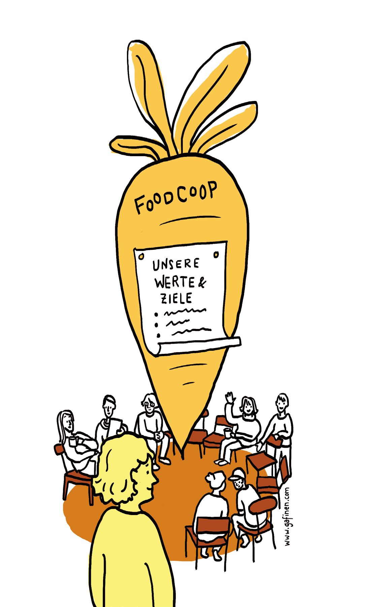

# Gemeinsame Leitgedanken festhalten

In einer FoodCoop kommen verschiedenste Menschen zusammen.
Das ist auch gut so, doch **es braucht eine „große gemeinsame Idee“**.
Damit für alle klar ist, wofür die Gruppe grundsätzlich steht, ist es
ratsam, zu Beginn die grundsätzlichen „Richtwerte“ zumindest grob
zu definieren und nach innen und außen zu kommunizieren. Die
Leitgedanken werden im Laufe der Gründungsphase zu konkreten
**Produktkriterien** weiterentwickelt (siehe eigenes Kapitel dazu). Zu
Beginn reichen auch Schlagworte. Die groben Motive und Ziele sollen
auf einen Blick ersichtlich sein.
**Interessierte können sich daran orientieren** und (hoffentlich)
selbst einschätzen, ob sie zu der Gruppe passen. Zusätzliche
Mitglieder sollen sich ja einerseits selbst in der Gruppe wohl fühlen
und ihre Ideen umsetzen können, andererseits auch von der Gruppe
als Bereicherung wahrgenommen werden. Passen die Meinungen
oder das Verhalten von Einzelpersonen in hohem Maße nicht zu
den gemeinsamen Leitgedanken, so wird die Aufnahme weder
die Person, noch die Gruppe glücklich machen.

_In der Startphase der FoodCoop-Gründung entsteht
ein Team mit gemeinsamen Werten und Zielen.
Die Gruppe soll dabei aber offen für die Aufnahme
weiterer Interessierter bleiben._
