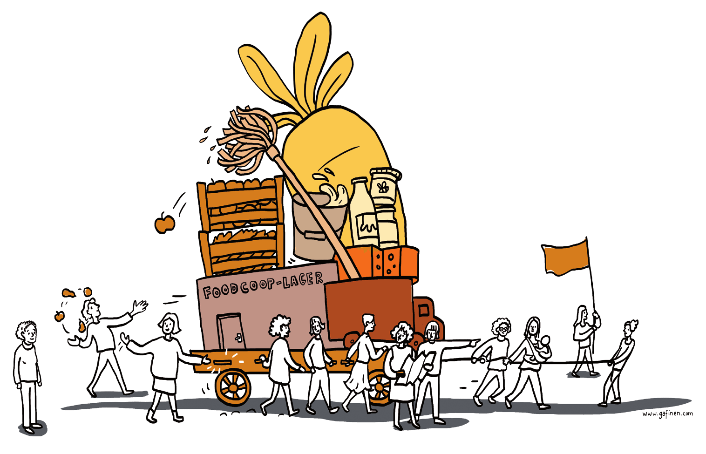

# Miteinander arbeiten

Eine FoodCoop ist auf kontinuierliches ehrenamtliches Engagement
ihrer Mitglieder angewiesen. Zwar gibt es im laufenden Betrieb keine
Großbaustellen wie bei der Gründung. Es fallen jedoch laufend kleinere
Arbeiten an, die von den Mitgliedern selbst zu erledigen sind.
**In einer gut organisierten FoodCoop leisten möglichst viele
Mitglieder einen Beitrag.** Der Arbeitsaufwand pro Person hält sich
dadurch in Grenzen (maximal ein paar Stunden im Monat) und ist
meistens flexibel einteilbar. Realität ist aber auch, dass es in wirklich
jeder FoodCoop Zeiten gibt, wo es mühsam ist, alle Abholdienste zu
besetzen oder die Speisereise wegen Zeitmangel schon zum dritten
Mal verschoben wird.

Die folgenden Seiten sollen euch unterstützen, in eurer FoodCoop
funktionierende Abläufe und ein gutes Arbeitsklima sicherzustellen.

Die drei Unterkapitel gehen auf jeweils eine der zentralen Fragen ein:

* Welchen Anforderungen muss die Organisationsform gerecht werden?
* Wie sieht das Organisationsmodell in der Theorie aus?
* Wie funktioniert das Organisationsmodell in der Praxis?

_Eine FoodCoop ist laufend in Bewegung, die Mitglieder tragen auf unterschiedliche
Weise dazu bei, dass die Initiative Stück für Stück vorankommt._
